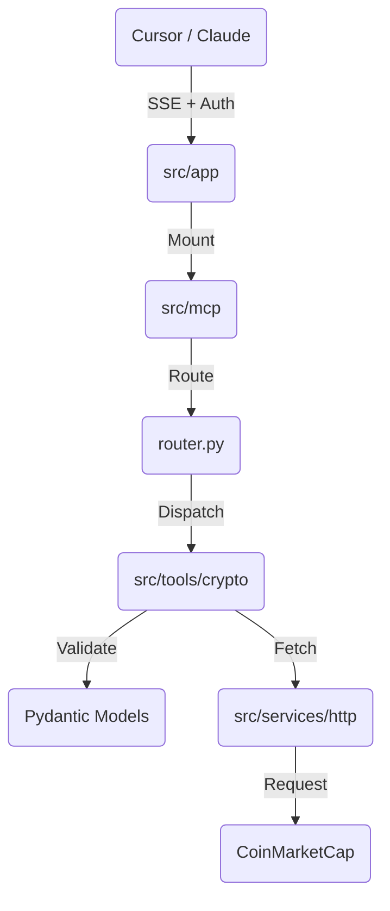

# 📈 Financial Market MCP Server

[](https://www.python.org)
[](https://fastapi.tiangolo.com)


> **Bridge the gap between LLMs and Real-Time Financial Data.**

This is a production-grade **Model Context Protocol (MCP)** server that empowers AI agents (like **Claude Desktop** and **Cursor**) to access real-time cryptocurrency data, historical metrics, news, and technical indicators via the CoinMarketCap API.

Built with a **Domain-Driven Design (DDD)** architecture, it wraps a high-performance MCP Core inside a robust FastAPI shell, offering **Server-Sent Events (SSE)** transport, Authentication, and comprehensive error handling.

---

## 🚀 Features

### 💎 Core Market Data

- **`get_crypto_prices`**: Real-time prices for any token (e.g., BTC, ETH).
- **`get_top_cryptos`**: Fetch top N cryptocurrencies by market cap.
- **`get_market_pairs`**: Active market pairs and exchange data.
- **`get_ohlcv_latest`**: Latest Open-High-Low-Close-Volume data.

### 📊 Analytics & Trends

- **`get_trending_cryptos`**: Identify coins with highest search volume surges (24h, 7d).
- **`get_global_crypto_metrics`**: Total market cap, BTC dominance, and active pairs.
- **`get_fear_and_greed_index`**: Analyze market sentiment.
- **`get_top_exchanges`**: Rank exchanges by liquidity and volume.

### 📜 Historical & Fundamental

- **`get_historical_prices`**: Time-travel price queries.
- **`get_crypto_metadata`**: Logos, whitepapers, descriptions, and official links.
- **`get_blockchain_statistics`**: Hashrates, difficulty, and transaction fees (e.g., for Bitcoin).
- **`get_latest_crypto_news`**: Aggregated news articles and headlines.

### 🧠 Advanced

- **`get_price_performance`**: ROI stats (ATH, ATL, 24h/7d/30d changes).
- **`get_cmc20_index`**: Performance of the top 20 assets.
- **`get_crypto_categories`**: Sector performance (e.g., DeFi, AI coins).

---

## 🏗️ Architecture

This project follows a **Standard**, separating concerns into distinct layers:



### Folder Structure

```text
src/
├── app/                 # 🌐 HTTP Layer (FastAPI, Auth, Middleware)
├── mcp/                 # 🔌 Protocol Layer (FastMCP, Routing)
├── tools/               # 🛠️ Business Logic (Crypto, Forex domains)
│   └── crypto/          #    - Specific tool implementations
├── services/            # 📡 Infrastructure (HTTP Clients, DB)
└── common/              # ⚙️ Shared Utils (Config, Logging)
```

---

## ⚡ Quick Start

### 1. Prerequisites

- Python 3.10+
- [CoinMarketCap API Key](https://pro.coinmarketcap.com/)

### 2. Installation

```bash
# Clone the repository
git clone https://github.com/yourusername/mcp-financial-market.git
cd mcp-financial-market

# Install dependencies
pip install -r requirements.txt
```

### 3. Configuration

Create a `.env` file in `deployments/env/.env`:

```ini
# CoinMarketCap API (Required)
COINMARKETCAP_API_KEY=your_cmc_key_here

# Server Security (Optional but Recommended)
# Generate one: openssl rand -hex 32
MCP_SERVER_API_KEY=your_secure_server_key

# App Config
LOG_LEVEL=INFO
HOST=0.0.0.0
PORT=8000
```

### 4. Run the Server

```bash
python -m src.app.main
```

_Server will start at `http://localhost:8000`_

---

## 🔌 Connecting to Clients

### Option A: Cursor AI (Recommended)

1. Go to **Settings** > **Features** > **MCP**.
2. Click **+ Add New MCP Server**.
   - **Name**: `CryptoMarket`
   - **Type**: `SSE`
   - **URL**: `http://localhost:8000/mcp/sse`
3. **Important**: If you set `MCP_SERVER_API_KEY`, ensure you add it to the headers config or disable auth locally for testing.

### Option B: Claude Desktop

Edit your config file (`%APPDATA%\Claude\claude_desktop_config.json` on Windows):

```json
{
  "mcpServers": {
    "CryptoMarket": {
      "url": "http://localhost:8000/mcp/sse",
      "headers": {
        "X-API-Key": "your_secure_server_key"
      }
    }
  }
}
```

---

## 🐳 Docker Deployment

The project includes a production-ready multi-stage Dockerfile.

```bash
# Build
docker-compose -f deployments/docker/docker-compose.yml build

# Run
docker-compose -f deployments/docker/docker-compose.yml up -d
```

---

## 🧪 Testing

We use `pytest` for unit and integration testing.

```bash
# Run all tests
pytest

# Run with verbose output
pytest -v
```

---

## 📚 API Reference

Once running, visit the auto-generated Swagger documentation:

- **Docs**: [http://localhost:8000/docs](http://localhost:8000/docs)
- **Health Check**: [http://localhost:8000/api/v1/health](http://localhost:8000/api/v1/health)
- **MCP SSE Endpoint**: `http://localhost:8000/mcp/sse`

---

## 🤝 Contributing

1. Fork the repo.
2. Create a feature branch (`git checkout -b feature/forex-tools`).
3. Add your new tool in `src/tools/`.
4. Register it in `src/mcp/router.py`.
5. Add tests in `tests/`.
6. Submit a Pull Request.

---

**License**: MIT
