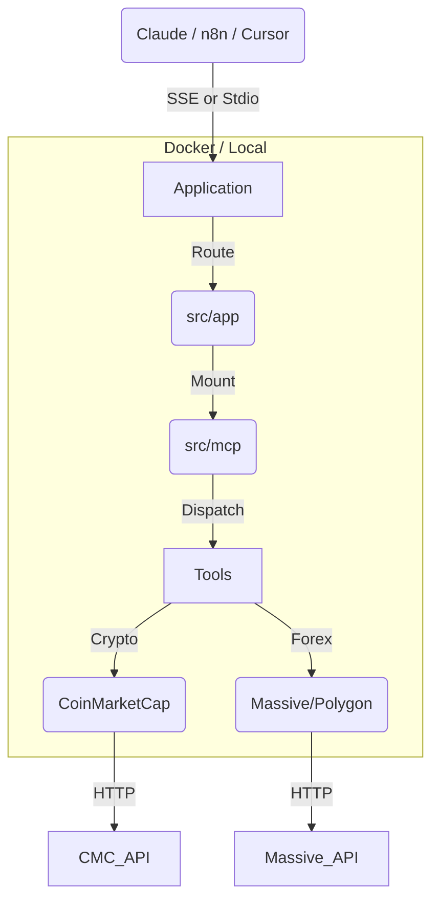

# 📈 Financial Market MCP Server (Crypto & Forex)

[](https://www.python.org)
[](https://fastapi.tiangolo.com)


> **Bridge the gap between LLMs and Real-Time Financial Markets.**

This is a production-grade **Model Context Protocol (MCP)** server that empowers AI agents (Claude, Cursor, n8n) to access real-time **Cryptocurrency** (via CoinMarketCap) and **Forex** (via Massive/Polygon) data.

Built with a **Domain-Driven Design (DDD)** architecture, it supports two running modes:

1.  **HTTP/SSE Server**: For production, Docker, and n8n.
2.  **Headless (Stdio)**: For local CLI usage and Claude Desktop.

---

## 🚀 Features

### 💎 Crypto Domain (CoinMarketCap)

- **Real-Time Data**: `get_crypto_prices`, `get_top_cryptos`, `get_market_pairs`.
- **Analytics**: `get_trending_cryptos`, `get_fear_and_greed_index`, `get_global_crypto_metrics`.
- **Fundamental**: `get_crypto_metadata` (Logos/Whitepapers), `get_blockchain_statistics`.
- **Historical**: `get_historical_prices`, `get_latest_ohlcv`.

### 💱 Forex Domain (Massive/Polygon)

- **Market Data**: `get_forex_tickers`, `get_forex_exchanges`.
- **Pricing**:
  - `get_forex_last_quote` (Real-time Bid/Ask - _Premium Plan_).
  - `get_forex_prev_close` (Daily OHLC - _Free Plan Compatible_).
  - `get_forex_conversion` (Real-time currency conversion).
- **Analysis**: `get_forex_movers` (Gainers/Losers).
- **Technical Indicators**: SMA, EMA, RSI, MACD, Bollinger Bands (`get_forex_indicator`).
- **History**: `get_forex_history` (Custom OHLC bars).

---

## 🏗️ Architecture



---

## ⚡ Quick Start

### 1. Prerequisites

- Python 3.10+ or Docker
- **CoinMarketCap API Key** ([Get one here](https://pro.coinmarketcap.com/))
- **Massive/Polygon API Key** ([Get one here](https://polygon.io/))

### 2. Configuration

Create a `.env` file in `deployments/env/.env`:

```ini
# --- API Keys ---
COINMARKETCAP_API_KEY=your_cmc_key
MASSIVE_API_KEY=your_massive_key
MASSIVE_BASE_URL=https://api.polygon.io

# --- Server Security ---
# Required for HTTP/SSE clients (n8n, Cursor)
MCP_SERVER_API_KEY=my_super_secret_key

# --- App Config ---
HOST=0.0.0.0
PORT=8000
DEBUG=True
```

### 3. Installation (Local)

```bash
# Install dependencies and project in editable mode
pip install -e .
```

---

## 🖥️ Running the Server

### Option A: Docker (Recommended)

This runs the full HTTP server with SSE support.

```bash
# Build and Run
docker-compose -f deployments/docker/docker-compose.yml up --build -d

# Check Health
docker ps
```

_Endpoint:_ `http://localhost:8000/mcp/sse`

### Option B: Local CLI (Headless)

Run directly in your terminal (useful for debugging or piping to other apps).

```bash
# Run using the configured entry point
mcp-cli
```

### Option C: Local HTTP Server

```bash
# Run using the configured entry point
mcp-server
```

---

## 🔌 Connecting Clients

### 1. n8n (Workflow Automation)

- **Prerequisite**: Run via Docker (Option A).
- **Node Type**: "SSE Trigger" or "MCP" (if available).
- **URL**: `http://mcp-server:8000/mcp/sse` (Internal Docker Network) or `http://host.docker.internal:8000/mcp/sse` (Local).
- **Header**: `X-API-Key: <your_mcp_server_key>`

### 2. Claude Desktop

Edit `%APPDATA%\Claude\claude_desktop_config.json`:

**Docker Method (Recommended):**

```json
{
  "mcpServers": {
    "FinancialMarket": {
      "command": "docker",
      "args": ["exec", "-i", "mcp_server", "python", "-m", "src.app.cli"]
    }
  }
}
```

**Local Python Method:**

```json
{
  "mcpServers": {
    "FinancialMarket": {
      "command": "python",
      "args": ["-m", "src.app.cli"],
      "env": {
        "COINMARKETCAP_API_KEY": "...",
        "MASSIVE_API_KEY": "..."
      }
    }
  }
}
```

### 3. Cursor AI

1.  **Settings** > **MCP**.
2.  **Add New Server**:
    - Type: `SSE`
    - URL: `http://localhost:8000/mcp/sse`

---

## 🧪 Testing

```bash
# Run Unit Tests
pytest

# Run Specific Forex Tests
pytest tests/unit/forex/ -v
```

---

## 🛠️ Project Structure

```text
mcp-financial-market/
├── deployments/         # Docker & K8s configs
│   ├── docker/
│   └── env/
├── src/
│   ├── app/             # FastAPI App & CLI Entry points
│   ├── mcp/             # FastMCP Protocol & Routing
│   ├── tools/           # Domain Logic
│   │   ├── crypto/      # CMC Implementation
│   │   └── forex/       # Massive/Polygon Implementation
│   └── common/          # Shared Utils
├── tests/               # Pytest Suite
└── pyproject.toml       # Dependencies & Build System
```

**License**: MIT
