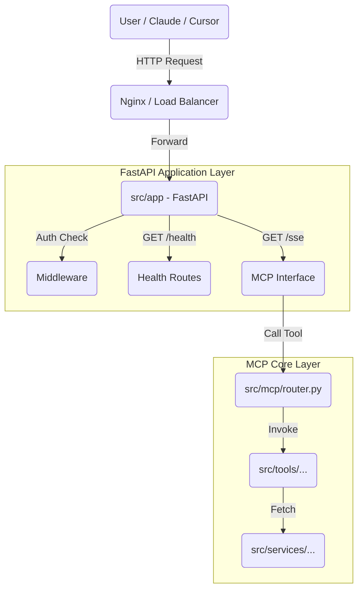

# Folder Structures

```markdown
mcp-server/
│
├── src/
│ ├── app/ # FastAPI server, lifecycle, configs
│ │ ├── **init**.py
│ │ ├── main.py # Entry point
│ │ ├── bootstrap.py # Startup/shutdown, DI wiring
│ │ ├── settings.py # Env configuration (Pydantic Settings)
│ │ │
│ │ ├── middleware/
│ │ │ ├── auth.py # Optional API key auth
│ │ │ ├── logging.py # Structured logging
│ │ │ └── request_id.py
│ │ │
│ │ └── exceptions/
│ │ ├── handlers.py # Global exception mapping
│ │ └── custom_exceptions.py
│ │
│ ├── mcp/ # MCP Protocol Only
│ │ ├── **init**.py
│ │ ├── protocol.py # Low-level MCP protocol (fastmcp)
│ │ ├── router.py # Tool registration logic
│ │ ├── tool_registry.py # Dynamic scanner / loader
│ │ └── schemas.py # Base types for MCP messages
│ │
│ ├── tools/ # Each tool is a separate module
│ │ ├── Crypto/
│ │ │ ├── tool.py
│ │ │ ├── service.py
│ │ │ ├── schemas.py
│ │ │ └── config.py
│ │ │
│ │ ├── Forex/
│ │ │ ├── tool.py
│ │ │ ├── service.py
│ │ │ ├── schemas.py
│ │ │ └── config.py
│ │ │
│ │ ├── documents/
│ │ │ ├── tool.py
│ │ │ ├── service.py
│ │ │ ├── schemas.py
│ │ │ └── config.py
│ │ │
│ │ └── **init**.py
│ │
│ ├── services/ # Infrastructure services shared by tools
│ │ ├── http/
│ │ │ ├── http_client.py
│ │ │ └── tradingview_api.py
│ │ ├── storage/
│ │ │ ├── mongo.py
│ │ │ ├── redis.py
│ │ │ └── qdrant.py
│ │ ├── parsers/
│ │ │ ├── pdf_parser.py
│ │ │ └── docx_parser.py
│ │ └── messaging/
│ │ ├── email_sender.py
│ │ └── telegram_sender.py
│ │
│ ├── common/ # Shared utilities
│ │ ├── logger.py
│ │ ├── cache.py
│ │ ├── security.py
│ │ └── utils.py
│ │
│ └── models/ # Pydantic schemas, DB models, metadata
│ ├── base.py
│ ├── tool_metadata.py
│ └── db_models.py
│
├── deployments/ # Prod packaging & ops
│ ├── docker/
│ │ ├── Dockerfile
│ │ ├── entrypoint.sh
│ │ └── docker-compose.yml
│ ├── systemd/
│ │ └── mcp-server.service # Optional: systemd service for linux servers
│ ├── nginx/
│ │ └── nginx.conf # Reverse proxy if needed
│ ├── k8s/
│ │ ├── deployment.yaml
│ │ ├── service.yaml
│ │ └── hpa.yaml
│ └── env/
│ ├── .env.example
│ └── production.env
│
├── scripts/
│ ├── build.sh
│ ├── start.sh
│ └── migrate_storage.py
│
├── tests/
│ ├── unit/
│ ├── integration/
│ └── e2e/
│
├── docs/
│ ├── ARCHITECTURE.md
│ ├── TOOL_GUIDELINES.md # How new teams add tools
│ └── DEPLOYMENT.md # Linux + Docker deployment steps
│
├── Makefile
├── pyproject.toml
└── README.md
```

### 🧠 The Architecture: "The Russian Doll" Pattern

We are not building two separate apps. We are building a **FastAPI Shell** that contains the **MCP Core**.



---

### 📋 Brainstorming Components

We need to decide exactly what goes into `src/app`. Here is the proposed feature set. Which ones do you want?

#### 1. The Transport Layer (SSE)

MCP clients (like Claude Desktop or Cursor) usually connect via **Stdio** (local) or **SSE** (remote HTTP).

- **Goal**: Expose a `/sse` endpoint so you can deploy this server to the cloud (Render/Railway/AWS) and connect to it remotely.
- **Implementation**: We will use `fastmcp`'s ability to mount onto FastAPI.

#### 2. Observability & Health

- **Goal**: If this runs in Kubernetes or Docker, we need to know if it's alive.
- **Endpoints**:
  - `GET /health`: Returns `{ "status": "ok", "version": "0.1.0" }`.
  - `GET /metrics`: (Optional) Prometheus metrics (request count, latency).

#### 3. Security (Authentication)

- **Goal**: You don't want random people using your CoinMarketCap API credits.
- **Implementation**:
  - **Public Routes**: `/health` (Open).
  - **Protected Routes**: `/sse`, `/messages`.
  - **Method**: `X-API-Key` header or Bearer Token.

#### 4. Documentation

- **Goal**: Make it easy for other developers to see what tools are available without reading code.
- **Implementation**: FastAPI automatically provides Swagger UI at `/docs`.

---

### 📂 Proposed Structure for `src/app`

This maps to the folder structure we agreed upon earlier.

```text
src/app/
├── __init__.py
├── main.py                 # The FastAPI entry point
├── bootstrap.py            # Startup logic (loading the MCP server)
├── settings.py             # HTTP-specific config (host, port, workers)
│
├── middleware/
│   ├── __init__.py
│   ├── auth.py             # API Key validation
│   └── logging.py          # Request logging
│
├── routes/
│   ├── __init__.py
│   ├── health.py           # Health checks
│   └── mcp_routes.py       # The SSE and Message endpoints
│
└── exceptions/
    └── handlers.py         # JSON error responses
```

---

### ❓ Strategic Questions (Your Decision Needed)

Before we write the code, I need your input on these 3 points:

1.  **Deployment Mode**:

    - **Option A (Stdio + HTTP)**: You primarily run it locally for Cursor/Claude, but want HTTP for debugging.
    - **Option B (HTTP Only)**: You plan to deploy this to a server and connect via SSE.
    - _Recommendation_: **Option B** (It's more robust for an L3 architecture).

2.  **Authentication**:

    - Do you want to secure the API with a simple static key (e.g., `MCP_SERVER_KEY=secret123`)?
    - _Recommendation_: **Yes**.

3.  **Prefix**:
    - Should we put everything under `/api/v1`?
    - _Recommendation_: **Yes**, cleaner API versioning.

---

### 📂 Directory Structure

Ensure your `tests` folder looks like this:

```text
tests/
├── __init__.py
├── conftest.py             # Shared fixtures (Mocks & Config)
├── unit/
│   ├── __init__.py
│   ├── test_services.py    # Test API Client logic
│   └── test_tools.py       # Test Tool formatting logic
└── integration/
    ├── __init__.py
    └── test_api.py         # Test FastAPI routes & Auth
```

---

### 🛠️ 1. The Configuration (`tests/conftest.py`)

This file is the "Engine Room" of your tests. It sets up the **Mock Environment** so your tests never hit the real CoinMarketCap API (saving you money and ensuring speed).

**File:** `tests/conftest.py`

```python
import pytest
from unittest.mock import MagicMock, patch
from fastapi.testclient import TestClient
from src.app.main import app
from src.common.settings import Settings

# 1. Mock Settings (Env Vars)
@pytest.fixture(scope="session")
def mock_settings():
    return Settings(
        COINMARKETCAP_API_KEY="test_cmc_key",
        COINMARKETCAP_BASE_URL="https://mock-api.com",
        LOG_LEVEL="DEBUG"
    )

# 2. Mock the CoinMarketCap Service
@pytest.fixture
def mock_cmc_service():
    with patch("src.tools.coinmarketcap.tool.cmc_service") as mock:
        yield mock

# 3. Test Client for FastAPI
@pytest.fixture
def client():
    # We use TestClient which runs the app without starting a real server
    return TestClient(app)

# 4. Valid Auth Headers
@pytest.fixture
def auth_headers():
    # Matches the key in your .env or the default mocked one
    return {"X-API-Key": "secret123"}
```

---

### 🧪 2. Unit Tests: Services (`tests/unit/test_services.py`)

Here we verify that your `CoinMarketCapService` correctly handles requests and errors.

**File:** `tests/unit/test_services.py`

```python
import pytest
from unittest.mock import patch, Mock
from requests.exceptions import HTTPError
from src.services.http.coinmarketcap_api import CoinMarketCapService

# Sample API Response
SAMPLE_QUOTE_RESPONSE = {
    "data": {
        "BTC": {
            "name": "Bitcoin",
            "quote": {"USD": {"price": 50000.00}}
        }
    }
}

class TestCoinMarketCapService:

    @pytest.fixture
    def service(self):
        # We patch get_settings to avoid needing a real .env file during tests
        with patch("src.services.http.coinmarketcap_api.get_settings") as mock_settings:
            mock_settings.return_value.COINMARKETCAP_API_KEY = "test_key"
            mock_settings.return_value.COINMARKETCAP_BASE_URL = "http://test-api"
            return CoinMarketCapService()

    def test_get_quotes_success(self, service):
        """Test that get_quotes returns data correctly."""
        with patch("requests.get") as mock_get:
            # Setup Mock
            mock_response = Mock()
            mock_response.json.return_value = SAMPLE_QUOTE_RESPONSE
            mock_response.status_code = 200
            mock_get.return_value = mock_response

            # Run Method
            result = service.get_quotes(["BTC"])

            # Verify
            assert result == SAMPLE_QUOTE_RESPONSE
            mock_get.assert_called_once()
            # Check if headers contain the key
            assert mock_get.call_args[1]['headers']['X-CMC_PRO_API_KEY'] == "test_key"

    def test_api_failure(self, service):
        """Test that HTTP errors are raised."""
        with patch("requests.get") as mock_get:
            mock_response = Mock()
            mock_response.raise_for_status.side_effect = HTTPError("401 Unauthorized")
            mock_get.return_value = mock_response

            with pytest.raises(HTTPError):
                service.get_quotes(["BTC"])
```

---

### 🛠️ 3. Unit Tests: Tools (`tests/unit/test_tools.py`)

This tests the actual MCP Tool logic (formatting strings, handling inputs) without hitting the external API.

**File:** `tests/unit/test_tools.py`

```python
from src.tools.coinmarketcap.tool import get_crypto_prices, get_top_cryptos

def test_get_crypto_prices_success(mock_cmc_service):
    """Test standard price fetching."""
    # 1. Setup Mock Return
    mock_cmc_service.get_quotes.return_value = {
        "data": {
            "BTC": {
                "name": "Bitcoin",
                "symbol": "BTC",
                "quote": {"USD": {"price": 99000.50}}
            }
        }
    }

    # 2. Call Tool
    result = get_crypto_prices(symbols="BTC")

    # 3. Assert Output format
    assert "Bitcoin (BTC): $99,000.50" in result
    mock_cmc_service.get_quotes.assert_called_with(["BTC"])

def test_get_crypto_prices_validation_error():
    """Test that invalid symbols return an error message immediately."""
    result = get_crypto_prices(symbols="INVALID_SYMBOL_TOO_LONG")
    assert "Input Validation Error" in result

def test_get_top_cryptos_success(mock_cmc_service):
    """Test top list fetching."""
    mock_cmc_service.get_listings.return_value = {
        "data": [
            {
                "cmc_rank": 1,
                "name": "Bitcoin",
                "symbol": "BTC",
                "quote": {"USD": {"price": 100.00}}
            }
        ]
    }

    result = get_top_cryptos(limit=5)

    assert "Top 5 Cryptocurrencies" in result
    assert "#1 Bitcoin (BTC): $100.00" in result
    mock_cmc_service.get_listings.assert_called_with(5)
```

---

### 🌐 4. Integration Tests: API (`tests/integration/test_api.py`)

This tests the "Outer Shell" (FastAPI, Auth, Routing).

**File:** `tests/integration/test_api.py`

```python
from fastapi.testclient import TestClient

def test_health_check(client: TestClient):
    """Test public health endpoint."""
    response = client.get("/api/v1/health")
    assert response.status_code == 200
    assert response.json()["status"] == "online"

def test_mcp_sse_unauthorized(client: TestClient):
    """Test that missing API key returns 403."""
    # Override settings to ensure auth is enabled for this test
    # (Assuming your test settings enable auth)
    response = client.get("/mcp/sse")
    # Note: Depending on how settings are mocked, this might be 403 or 401
    assert response.status_code in [401, 403]

def test_mcp_sse_authorized(client: TestClient, auth_headers):
    """
    Test that valid API key allows connection.
    Note: SSE endpoints hang open, so TestClient might block or return immediately
    depending on the implementation. We check for the initial handshake status.
    """
    with client.stream("GET", "/mcp/sse", headers=auth_headers) as response:
        assert response.status_code == 200
        # Verify it's an event stream
        assert "text/event-stream" in response.headers["content-type"]
```

---

### 🚀 How to Run the Tests

1.  **Install Testing Dependencies**:
    If you haven't already:

    ```bash
    pip install pytest pytest-mock httpx
    ```

2.  **Run All Tests**:

    ```bash
    pytest
    ```

3.  **Run with Verbose Output (See pass/fail details)**:

    ```bash
    pytest -v
    ```

4.  **Run only Unit Tests**:
    ```bash
    pytest tests/unit
    ```

### ✅ What this achieves

- **Safety**: You can refactor code without breaking features.
- **Speed**: Tests run in milliseconds because we mocked the slow API calls.
- **Reliability**: Authentication is verified before you deploy.
